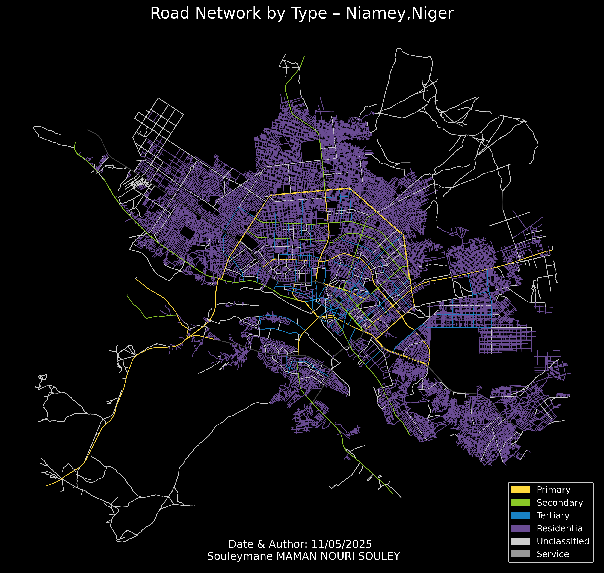

# Road Network Visualization Toolkit 🛣️

A Python package for visualizing and analyzing road networks using OpenStreetMap data.



## Features

- 🗺️ Generate interactive road network maps
- 🎨 Custom color schemes for different road types
- 📊 Export high-resolution visualizations
- 🌍 Works with any city worldwide
- 📦 Lightweight and easy to integrate

## Installation

### Requirements

- Python 3.8+
- [OSMnx](https://osmnx.readthedocs.io/)
- [GeoPandas](https://geopandas.org/)
- [Matplotlib](https://matplotlib.org/)

```bash
# Clone repository
git clone https://github.com/halieute/Python-tips.git
cd road-network-visualizer

# Install dependencies
pip install -r requirements.txt

# Optional: Jupyter Notebook support
pip install jupyter